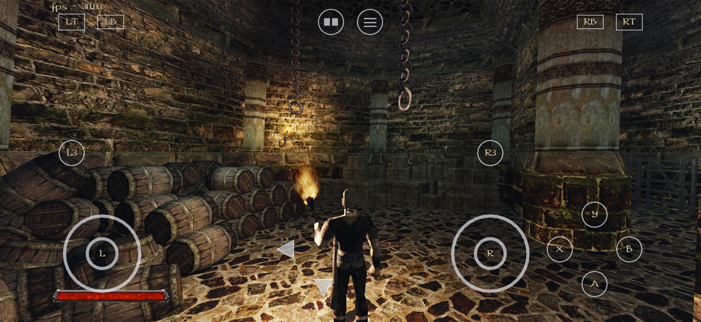

# OpenGothic for iOS

An **unofficial iPhone and iPad port** of
[Try/OpenGothic](https://github.com/Try/OpenGothic), the open-source
reimplementation of *Gothic II: Night of the Raven*. This branch provides a
ready-to-sideload iOS build with touch controls, physical-controller support
and a mobile performance profile.

> [!IMPORTANT]
> OpenGothic contains no original Gothic II assets. You must legally own
> *Gothic II: Night of the Raven* and copy the game data from your installation.

> [!NOTE]
> The engine is developed by [Try](https://github.com/Try) and the OpenGothic
> contributors. This fork maintains the iOS integration. Please support the
> [upstream project](https://github.com/Try/OpenGothic).



## Install on iPhone or iPad

The maintained build uses MetalFX Spatial with an automatic Lanczos fallback.
MetalFX Temporal is not part of the maintained public application.

1. Set up [SideStore](https://sidestore.io) or another compatible sideloading
   client.
2. In SideStore open **Sources**, tap **+** and add:

   `https://raw.githubusercontent.com/tryk016/OpenGothic/codex/ios-upstream-integration/apps.json`

3. Install **OpenGothic MetalFX Spatial** from the new source.
4. In the iOS Files app open **On My iPhone/iPad → OpenGothic** and copy the
   `Data/`, `_work/` and `system/` folders from your own Gothic II:
   Night of the Raven installation.
5. Launch OpenGothic.

The IPA is unsigned and must be signed by the sideloading client. Normal
updates preserve the app's `Documents` directory, settings and saves. Do not
uninstall an existing copy before backing up that directory.

- [Download release](https://github.com/tryk016/OpenGothic/releases/tag/ios-v1.3.1-spatial)
- [Complete installation and local-build guide](docs/ios/INSTALL.md)

## Requirements

- iPhone or iPad with a 64-bit Apple processor
- iOS or iPadOS 15.0 or newer
- A legally owned copy of *Gothic II: Night of the Raven*
- Landscape orientation

A physical controller is optional.

## Controls

The on-screen controller includes two full-size analog sticks, A/B/X/Y,
shoulders, triggers, stick clicks, View/Menu and a four-direction D-pad. It
hides automatically when a physical controller is connected.

[](assets/controller/OpenGothic_Controller_Layout.svg)

| Action | Xbox | PlayStation |
|---|---|---|
| Interact / use / confirm | A | Cross |
| Melee special / back | B | Circle |
| Jump / climb | X | Square |
| Draw or sheathe weapon | Y | Triangle |
| Move / turn | Left stick | Left stick |
| Camera | Right stick | Right stick |
| Aim bow / melee block | LT | L2 |
| Draw melee / attack / shoot / cast | RT | R2 |
| Walk / melee left attack | LB | L1 |
| Look back / melee right attack | RB | R1 |
| Sneak | L3 | L3 |
| Target lock | R3 | R3 |
| Items ring | D-pad up | D-pad up |
| Weapons and Magic ring | D-pad down | D-pad down |
| Quest log / previous target | D-pad left | D-pad left |
| Map / next target | D-pad right | D-pad right |
| Inventory | View | Share / Create |
| Game menu | Menu | Options |

When the main or in-game menu is open, **Y/Triangle** opens the native iOS
device settings with the controller diagram, Off/30/60 FPS selection and UI
language choice.

The iOS interface supports automatic language selection plus English, German,
Polish, Russian, French, Spanish, Italian and Czech. Game dialogue and subtitle
availability still depends on the data copied by the user.

See the [controller reference](docs/ios/CONTROLLER.md) for quick rings,
contextual combat controls, configuration and the complete validation matrix.

## iOS performance profile

The recommended release enables:

- MetalFX Spatial with automatic Lanczos fallback;
- two 512 × 512 mobile shadow maps;
- reduced skeletal-pose work for distant, off-screen NPCs;
- three frames in flight and direct Metal drawable rendering with a safe copy
  fallback;
- verified precompiled startup Metal libraries with runtime compilation
  fallback.

The aggressive dialog/cutscene NPC-pose mode remains disabled to preserve scene
behavior. Other platforms retain their existing defaults.

## Build from source

Clone the maintained integration branch with all dependencies:

```sh
git clone --recurse-submodules --branch codex/ios-upstream-integration \
  https://github.com/tryk016/OpenGothic.git
cd OpenGothic
./ios/build-ios.sh
open build-ios/OpenGothic.xcodeproj
```

Select the `Gothic2Notr` target, choose your Apple development team and run on
the connected device. Full signing, unsigned-build and data-copy instructions
are in [docs/ios/INSTALL.md](docs/ios/INSTALL.md).

## Documentation

- [iOS port overview](docs/ios/README.md)
- [Installation and game-data setup](docs/ios/INSTALL.md)
- [Controller implementation and validation](docs/ios/CONTROLLER.md)
- [Startup Metal shader design](docs/ios/SHADER-STARTUP.md)
- [License](LICENSE)

Controller glyphs are
[Xelu's Free Controller & Keyboard Prompts](https://thoseawesomeguys.com/prompts)
by Nicolae “Xelu” Berbece (CC0). Attribution is included in
[the asset license](assets/controller/LICENSE.md).

For Windows, Linux, macOS, mods and general engine development, see
[Try/OpenGothic](https://github.com/Try/OpenGothic).
