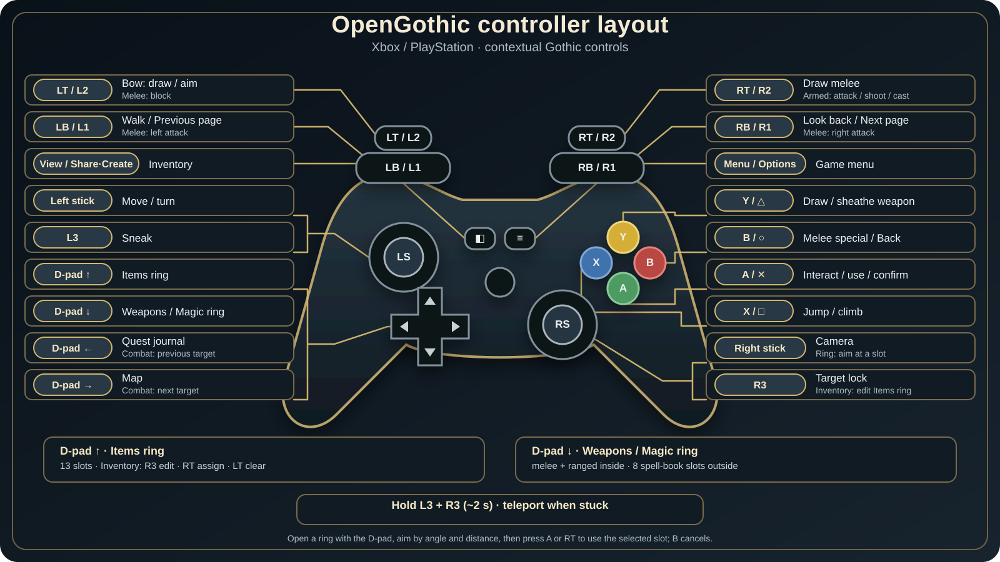

# OpenGothic on iOS

OpenGothic includes an iPhone and iPad target for *Gothic II: Night of the
Raven*. The target uses the same OpenGothic game code and Tempest Metal backend
as the other supported platforms, with iOS-specific lifecycle, display, input,
audio and file-access integration.

OpenGothic does not contain the original game data. You must legally own
*Gothic II: Night of the Raven* and copy the required files from your own
installation. See [Installation](INSTALL.md) for the complete build, signing and
data-copy procedure.

## Platform requirements

- iPhone or iPad with a 64-bit Apple processor
- iOS or iPadOS 15.0 or newer
- Metal support
- Landscape orientation
- A physical controller is optional; the complete on-screen controller can be
  used instead

The application bundle enables iOS File Sharing so that game data, saves and
configuration can be managed through the app's `Documents` directory.

## Input

The iOS target supports two equivalent input paths:

- **Physical controller:** controllers exposed through Apple's GameController
  framework use a contextual Xbox/PlayStation-style mapping.
- **On-screen controller:** a full touch controller provides movement and
  camera areas, A/B/X/Y, shoulder buttons, triggers, stick clicks, D-pad,
  View and Menu. It automatically hides while a physical controller is
  connected.

Both paths use the same input reducer and contextual actions. Held world
actions are released when a menu or quick ring opens, when the controller
disconnects, and when the application resumes, preventing stale input from
crossing UI or lifecycle boundaries.

| Action | Xbox | PlayStation |
|---|---|---|
| Interact / use / confirm | A | Cross |
| Melee special / back | B | Circle |
| Jump / climb | X | Square |
| Draw or sheathe weapon | Y | Triangle |
| Move / turn | Left stick | Left stick |
| Camera | Right stick | Right stick |
| Aim bow / melee block | LT | L2 |
| Draw melee / attack / shoot / cast | RT | R2 |
| Walk / melee left / previous character page | LB | L1 |
| Look back / melee right / next character page | RB | R1 |
| Sneak | L3 | L3 |
| Target lock | R3 | R3 |
| Edit highlighted inventory item in Items ring | R3 | R3 |
| Items ring | D-pad up | D-pad up |
| Weapons and Magic ring | D-pad down | D-pad down |
| Quest log / previous combat target | D-pad left | D-pad left |
| Map / next combat target | D-pad right | D-pad right |
| Inventory | View | Share / Create |
| Game menu | Menu | Options |
| Unstuck action | Hold L3 + R3 for about two seconds | Hold L3 + R3 for about two seconds |

### Contextual controls

- D-pad up opens the Items ring. It has four inner and nine outer slots and can
  be filled automatically or edited from the inventory.
- D-pad down opens the Weapons and Magic ring, populated from equipped weapons
  and active spell-book slots.
- LT blocks in melee and aims a bow. RT attacks, shoots or casts. LB and RB
  become directional melee attacks when appropriate.
- R3 locks the current target. While locked, D-pad left and right cycle combat
  targets; otherwise they open the journal and map.
- Journal and Statistics pages support D-pad navigation and LB/RB page changes.
- Menus and dialogues expose touch D-pad, confirm, back and skip controls. The
  touch controller also exposes the quick rings and their panel switching.

The controller diagram in the native iOS device-settings overlay is usable with
either touch or a physical controller. Controller implementation details and
the manual validation matrix are in
[the controller maintainer reference](CONTROLLER.md).

Controller prompt artwork is based on Xelu's Free Controller & Keyboard
Prompts; its attribution and CC0 notice are included in
[the controller asset license](../../assets/controller/LICENSE.md).

## Native iOS UI languages

The native controller diagram and device-settings overlay support eight
languages:

- English
- German
- Polish
- Russian
- French
- Spanish
- Italian
- Czech

The default `AUTO` mode follows a valid language selected by the installed game
data, then the preferred iOS language, and finally English. The overlay language
can be selected independently without modifying `MENU.DAT`. Availability of
original dialogue, subtitles and other game content still depends on the
language files present in the user's legally owned installation.

## Graphics and display

The default iOS renderer remains Tempest Metal. The following build-time paths
are optional and do not change the renderer used on other platforms:

- three frames in flight;
- direct rendering to a Metal drawable, with a safe copy fallback;
- deferred skeletal-pose updates for distant, off-screen NPCs while animation
  time and gameplay events continue to advance;
- Metal shader-module caching;
- precompiled libraries for the small startup shader set, with normal runtime
  compilation as the authoritative fallback;
- MetalFX Spatial upscaling with a Lanczos fallback.

The maintained public build enables Spatial and leaves the experimental
Temporal path disabled.

MetalFX support is opportunistic. If a requested scaler is unavailable or
rejects the active texture configuration, rendering falls back without making
MetalFX a requirement for the application. A build without MetalFX uses the
existing Lanczos path when reduced-resolution rendering needs upscaling.

Precompiled startup shaders are similarly optional. The bundle carries
platform- and Metal-language-specific libraries plus canonical source and
expected hashes. Any missing or incompatible resource returns to Tempest's
runtime SPIR-V-to-MSL compilation path. See
[the shader startup reference](SHADER-STARTUP.md) for the exact
profile and validation rules.

The iOS display policy supports Off, 30 and 60 FPS selections. `Off` requests
the system-supported adaptive range; explicit limits are applied through
`CADisplayLink` rather than sleeping the render and UI thread. The HUD and
touch controls account for the safe area while the 3D scene remains full-bleed.

## Device settings and configuration

While a game menu is open, the Y/Triangle control opens the native iOS device
settings. The touch UI exposes the same button. The overlay contains:

- Off, 30 and 60 FPS choices;
- `AUTO` plus the eight explicit native-UI languages.

The copied PC configuration is kept separate from iOS-owned settings:

1. `Documents/system/Gothic.ini` is the base configuration from the game data.
2. `Documents/Gothic.ini` is the writable iOS override and has higher priority.

OpenGothic creates the override after it validates the installed game data. It
contains the iOS render profile, FPS choice and controller response settings.
Deleting or renaming the override regenerates the current defaults on the next
successful launch without changing `system/Gothic.ini`.

New iOS profiles use two 512 x 512 shadow maps. Existing
`ENGINE/shadowResolution` values are preserved, so users can choose a higher
resolution explicitly without affecting desktop defaults.

Common controller keys under `[GAMEPAD]` include `analogDeadZone`,
`analogEngageZone`, `deadZone`, `releaseZone`, `crossAxisGuard`,
`triggerThreshold`, `lookSensitivity`, `invertY` and `noStuckProtect`.

## iOS-specific integration boundaries

The port keeps platform behavior behind iOS build guards or neutral Tempest
APIs. Its principal integration areas are:

- UIKit scene activation, backgrounding and display-link scheduling;
- controller snapshots, touch input, safe-area layout and haptics;
- iOS audio-session setup;
- working-directory-first access to user data with application-bundle fallback;
- Metal swapchain, upscaler and startup-library options exposed through Tempest;
- fence-safe save-preview capture and recovery when a preview cannot be made.

Desktop behavior and the original menu data remain unchanged. New native
overlays do not depend on hard-coded positions from `MENU.DAT`, which also
keeps custom and localized menu data compatible.

## Further reading

- [Build, installation and game-data setup](INSTALL.md)
- [Physical and touch controller maintainer reference](CONTROLLER.md)
- [Precompiled startup shader design](SHADER-STARTUP.md)
- [OpenGothic license](../../LICENSE)
